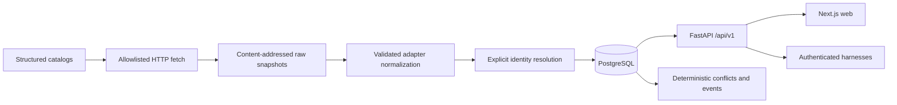

# Architecture

Fener is a local-first model market database, deterministic decision engine and private evaluation lab. It uses a monorepo, PostgreSQL, one FastAPI service, one worker and a Next.js client. No Redis, AI crawler or autonomous policy mutation is needed.

## Boundaries

- `services/api/fener`: shared domain, persistence, source adapters, read API and intelligence functions.
- `services/worker`: CLI and scheduler using the same data layer. Each source commits independently.
- `apps/web`: strict TypeScript, TanStack Query/Table and ECharts. Server proxy keeps administration credentials out of browser bundles.
- `infra`: local PostgreSQL and container builds. SQLite is an explicitly limited offline development/test fallback, not a substitute for PostgreSQL integration validation.

## Immutable principles

Canonical models are separate from deployments. Access platforms are separate from upstream inference providers. Every external fact references a source record and raw snapshot. Observations are append-only. Money uses Decimal/NUMERIC. Unknown does not mean false or zero. Ambiguous identities remain separate candidates. No AI writes canonical facts. Private telemetry and evaluations require authentication and are excluded from market exports.

## Identity and authority

Use explicit base-model references and exact source-scoped aliases. Never fuzzy-strip date, quantization, reasoning or free-tier suffixes. Unresolved candidates have stable source-qualified identities. Deployment identity includes access provider, upstream if known, API identifier and endpoint variant. A marketplace catalog's lowest price is a routing quote, not a named upstream price.

Authority is scoped to the fact. A provider selling price outranks a catalog cross-check of that same deployment. Benchmark evidence remains separate by version/evaluator. Newness alone does not determine authority. Competing current claims are retained as conflicts.

## Rollout

Deliver validated vertical slices and local Conventional Commits. Preserve the existing repository license. Nothing is pushed or published. AI research, paid inference evaluation, auto-switching and public accounts are not enabled by default.
